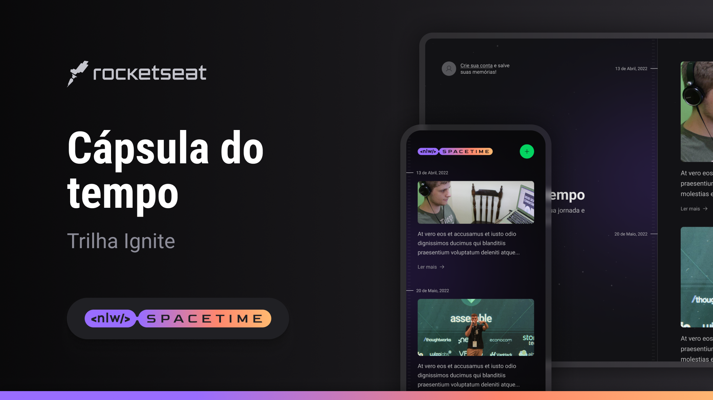

<h1 align="center">NLW Spacetime</h1>

<div align="center">
  
</div>

<p align="center">
  <a href="#-sobre">Sobre</a>
  &nbsp;&nbsp;&nbsp;|&nbsp;&nbsp;&nbsp;
  <a href="#-tecnologias-utilizadas">Tecnologias utilizadas</a>
  &nbsp;&nbsp;&nbsp;|&nbsp;&nbsp;&nbsp;
  <a href="#-como-baixar-o-projeto">Como baixar o projeto</a>
  &nbsp;&nbsp;&nbsp;|&nbsp;&nbsp;&nbsp;
  <a href="https://www.figma.com/community/file/1240070456276424762">Layout</a>
</p>

## 📖 Sobre

<p id="-sobre" />

O NLW Spacetime é um projeto desenvolvido durante a Next Level Week, evento realizado pela [Rocketseat](https://rocketseat.com.br/).
Consiste em desenvolver uma aplicação completa com backend, frontend e mobile, para que os usuários possam cadastrar e relembra momentos importantes de suas vidas.

## 🚀 Tecnologias utilizadas

<p id="-tecnologias-utilizadas" />

- [Node.js](https://nodejs.org/en/) - É um interpretador de JavaScript assíncrono com código aberto orientado a eventos.
- [React](https://pt-br.reactjs.org/) - Uma biblioteca JavaScript para criar interfaces de usuário.
- [React Native](https://reactnative.dev/) - É uma biblioteca Javascript criada pelo Facebook. É usada para desenvolver aplicativos para os sistemas Android e IOS de forma nativa.
- [Next](https://nextjs.org/) - É um framework React com foco em produção e eficiência criado e mantido pela equipe da Vercel.
- [Expo](https://expo.io/) - É uma ferramenta utilizada no desenvolvimento mobile com React Native que permite o fácil acesso às API's nativas do dispositivo sem precisar instalar qualquer dependência ou alterar código nativo.
- [TypeScript](https://www.typescriptlang.org/) - É um superconjunto de JavaScript desenvolvido pela Microsoft que adiciona tipagem e alguns outros recursos a linguagem.
- [Prisma](https://www.prisma.io/) - É um ORM (Object-Relational Mapping) para Node.js e TypeScript.
- [Zod](https://zod.dev/) - É uma biblioteca de validação de esquema TypeScript com foco em ergonomia e desempenho.
- [React Hook Form](https://react-hook-form.com/) - É uma biblioteca de validação de formulários para React.

## 📦 Como baixar o projeto

<p id="-como-baixar-o-projeto" />

```bash
    # Clonar o repositório
    $ git clone

    # Entrar no diretório
    $ cd nlw-spacetime

    # Acessar diretório (server, web ou mobile)
    $ cd server

    # Instalar as dependências
    $ npm install

    # Iniciar o projeto
    $ npm run dev
```

### 🖊️ Autor - [@raniellimontagna](https://www.github.com/raniellimontagna)
